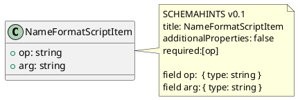

# HATPRO Schema & Repo Conventions

_Last updated: 2025-10-14_

## TL;DR (cheat sheet)
- **One class per `.puml`** → one **JSON Schema**.
- Put class files in `packages/**/<Thing>/content/puml/`; put diagram-only files in `.../puml/views/`.
- **SCHEMAHINTS** in each class file define **types, constraints, and relationships** (`ref`, `itemsRef`, etc.).
- Use **absolute URLs** in `ref:`/`itemsRef:` that match the schema `$id` (e.g., `https://example.org/hatpro/schema/CurrencyAmount.schema.json`).
- Keep **all enums external** under `.../content/json/enums/` and reference them with `enumRef` / `itemsEnumRef`.
- The **generator** walks `packages/**/content/puml` (ignores `views/`) and emits to `.../content/json/schemas/`.
- The **validator** loads schemas from `packages/**/content/json/schemas` and enums from `packages/**/content/json/enums` then validates samples.
- **Views do not affect schemas**—they’re for diagrams only.

---

## 1) Repository Organization

### 1.1 Containers (“ownable things”)
Each major class, sub-domain, or reusable library lives in its own **container** folder with a `content/` subtree:

```
packages/
  core/
    TravelProfile/
      content/
        puml/
          travelprofile.puml
          views/
            travelprofile.view.puml
        json/
          schemas/        # GENERATED
          enums/          # (optional) truly global lists
        samples/
        scripts/
  identity/
    Name/
      content/
        puml/
          Name.puml
          NameDisplayLayout.puml
          NameFormatScript.puml
          NameFormatScriptItem.puml
          views/
            NameOverview.view.puml
        json/
          schemas/        # GENERATED
          enums/          # local code lists for Name
        samples/
        scripts/
  CommonLib/
    Strings/
      InternationalString/
        content/
          puml/InternationalString.puml
          json/schemas/   # GENERATED
          json/enums/
          samples/
          scripts/
```

Notes:
- You can add more containers (e.g., `contact/CommChannels`, `contact/PhoneInfo`, etc.).
- Keep **reusable primitives** in **`CommonLib/`** containers (e.g., `CurrencyAmount`, `InternationalString`).

### 1.2 Naming
- Class files: **`<ClassName>.puml`** (lowercase is fine for root files like `travelprofile.puml`, but prefer **ClassName.puml**).
- View files: **`*.view.puml`** (to avoid confusion with class files).
- Generated files: `.../content/json/schemas/<ClassName>.schema.json`.
- Enum files: `.../content/json/enums/<domain>/<EnumName>.json`.

---

## 2) PlantUML: Classes vs Views

### 2.1 Class files (schema-driving)
- Location: `.../content/puml/<ClassName>.puml`
- Contains **one** `class` definition and **one SCHEMAHINTS** block.
- **One file → one schema** (the first class is emitted—keep one class per file).

**Example — `NameFormatScriptItem.puml`:**


### 2.2 View files (diagram-only)
- Location: `.../content/puml/views/*.view.puml`
- Purpose: visual diagrams for humans.
- Use `!include` to pull in class files, draw associations.
- **Ignored by the generator**—no SCHEMAHINTS here.

**Example — `NameOverview.view.puml`:**
```puml
@startuml
!include_once ../NameDisplayLayout.puml
!include_once ../NameFormatScript.puml
!include_once ../NameFormatScriptItem.puml
hide methods
NameDisplayLayout o-- NameFormatScript : format
NameFormatScript  o-- NameFormatScriptItem : items[*]
@enduml
```

> `!include` paths are **relative filesystem paths for PlantUML only**. They have **no effect** on JSON Schema.

---

## 3) SCHEMAHINTS — Source of Truth for JSON Schemas

SCHEMAHINTS drives the generated JSON Schema. Use it to define properties, required fields, constraints, and cross-schema links.

### 3.1 Core fields
- `title:` — schema title (also used for output file name).
- `additionalProperties:` — set to `false` for strict models.
- `required:[...]` — list required properties.
- `field <name>:` — define each property.

### 3.2 Property kinds
- **Simple type:**
  ```
  field count: { type: integer, minimum: 0 }
  ```
- **Reference to another schema (object):**
  ```
  field layout:
    ref: https://example.org/hatpro/schema/NameDisplayLayout.schema.json
  ```
- **Array of objects:**
  ```
  field items:
    type: array
    itemsRef: https://example.org/hatpro/schema/NameFormatScriptItem.schema.json
  ```
- **External enum (single value):**
  ```
  field kind:
    enumRef: contact/PhoneKind.json
  ```
- **External enum (array of values):**
  ```
  field appTags:
    type: array
    itemsEnumRef: contact/SocialApp.json
    uniqueItems: true
  ```

### 3.3 Advanced composition (optional)
- `oneOfRef: [ <absolute-id>, ... ]`
- `allOfRef: [ ... ]`
- `anyOfRef: [ ... ]`
- Inline `oneOf`/`allOf`/`anyOf` is also supported when needed.

### 3.4 Patterns & formats
- Use `format:` for common formats (`email`, `uri`, `date`, `date-time`, etc.).
- Use `pattern:` (ECMAScript regex, no flags) for structural checks:
  - Currency code: `^[A-Z]{3}$`
  - ISO 15924 script: `^[A-Z][a-z]{3}$`
  - Country (alpha-2): `^[A-Z]{2}$`

---

## 4) External Enums & Standards

We use **external files** for all enums to enable independent updates and translation mapping.

### 4.1 Enum file template
```json
{
  "$id": "https://example.org/hatpro/schema/contact/PhoneKind.json",
  "$schema": "https://json-schema.org/draft/2020-12/schema",
  "title": "PhoneKind",
  "type": "string",
  "enum": ["Mobile","Home","Work","Other"],
  "x-i18n-key": "contact.PhoneKind"
}
```

### 4.2 Pattern-only schemas for standards
For ISO-like constraints, keep **pattern-only** schemas and reference them with `ref` / `itemsRef`:
```json
{
  "$id": "https://example.org/hatpro/schema/iso/CurrencyCode.json",
  "$schema": "https://json-schema.org/draft/2020-12/schema",
  "title": "CurrencyCode",
  "type": "string",
  "pattern": "^[A-Z]{3}$"
}
```

> For strict enforcement (shape + allow-list), create a `*.strict.json` that uses `allOf` to combine the pattern schema and an allow-list schema.

---

## 5) Arrays — recommended defaults
- For collections with potential duplicates (emails, phones), consider:
  ```
  field emails:
    type: array
    itemsRef: https://example.org/hatpro/schema/EmailInfo.schema.json
    uniqueItems: true
  ```
- For mandatory collections: add `minItems: 1`.
- For inlined primitives: use `itemsEnumRef` (for code lists) or `items: { ... }` for inline shapes.

---

## 6) IDs, Refs, and URLs

- Run the generator with a **base ID** (e.g., `--baseId https://example.org/hatpro/schema/`).
- Each generated schema gets a stable **`$id`**: `https://example.org/hatpro/schema/<Title>.schema.json`.
- In SCHEMAHINTS, use **absolute** `ref:`/`itemsRef:` URLs that match those `$id`s.
- Enum references can be **relative** (`enumRef: contact/PhoneKind.json`)—the validator preloads them.

> Folder paths can change without breaking `$ref`, as long as `$id` stays stable.

---

## 7) Tools & Workflow

### 7.1 Generation
```
node tools/generate-json-from-puml.mjs --baseId https://example.org/hatpro/schema/
```

### 7.2 Validation
```
node tools/validate-with-ajc.mjs
```
- Validates that `*.valid.json` pass and `*.invalid.json` fail.
- Preloads schemas from `packages/**/content/json/schemas` and enums from `packages/**/content/json/enums`.

### 7.3 Optional: Bundle root schema
```
npm i -D json-schema-ref-parser
node tools/bundle-schema.mjs
```
Emits `TravelProfile.bundle.schema.json` with all `$ref`s dereferenced (consumer-friendly).

### 7.4 Optional: Enum audit in CI (dev-time correctness)
Keep curated source lists in `sources/` and run a script that checks enum files against regex shape and known lists. (See `tools/audit-enums.mjs` pattern.)

---

## 8) PlantUML Export (diagrams only)

- Configure the PlantUML extension to export **only** from `.../puml/views/` to `docs/diagrams/`:
```json
{
  "plantuml.exportFormat": "svg",
  "plantuml.exportOutDir": "docs/diagrams",
  "plantuml.exportSubFolder": true,
  "plantuml.diagramsRoot": "packages/**/content/puml/views",
  "plantuml.fileExtensions": ["puml"]
}
```
- Add to `.gitignore`:
```
# PlantUML renders
*.png
*.svg
*.txt
docs/diagrams/
plantuml-out/
```

---

## 9) Do / Don’t Checklist

**Do**
- One class per `.puml` file under `content/puml/`.
- Put all constraints and relationships in **SCHEMAHINTS**.
- Use **absolute** refs for schemas; **relative** refs for enums are OK.
- Keep enums external; use codes (not labels).
- Add `additionalProperties: false` unless you want open models.
- Keep **views** separate; they never contain SCHEMAHINTS.

**Don’t**
- Don’t rely on UML lines in views to create schema relationships.
- Don’t put multiple reusable classes in one `.puml` (only the first would generate).
- Don’t use filesystem paths in `ref:`—use the schema `$id` URLs.

---

## 10) Onboarding Steps (for new contributors)
1. Clone repo and run: `npm run gen && npm run validate`.
2. Create a new container for your type under `packages/<segment>/<Thing>/content/`.
3. Add a single class `.puml` with SCHEMAHINTS; generate and validate.
4. If needed, add enums under `.../content/json/enums/<domain>/` and reference via `enumRef`.
5. Add sample JSONs (`*.valid.json`, `*.invalid.json`) under `.../content/samples/`.
6. (Optional) Add a view diagram under `.../puml/views/` and export to `docs/diagrams/`.

---

## Appendix A — SCHEMAHINTS reference (quick)
```
SCHEMAHINTS v0.1
title: <Title>
additionalProperties: <true|false>
required:[<field1>, <field2>, ...]

field <name>:
  type: string|number|integer|boolean|object|array
  format: email|uri|date|date-time|...
  pattern: <ECMAScript-regex>
  minimum|maximum|minLength|maxLength|...
  enumRef: <relative-enum-path.json>
  itemsEnumRef: <relative-enum-path.json>
  ref: <absolute-schema-id-url>
  itemsRef: <absolute-schema-id-url>
  oneOfRef: [ <absolute-schema-id-url>, ... ]
  allOfRef: [ ... ]
  anyOfRef: [ ... ]
```
