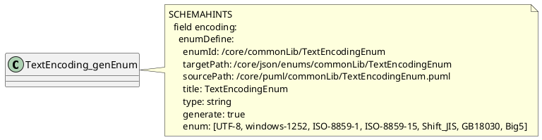

# HATPro Developers Guide v0.1

> **Purpose:** Integrated reference for HATPro contributors — both new collaborators and experienced JSON Schema developers.

This guide consolidates the modeller’s guide, SCHEMAHINTS/ENUMHINTS manuals, and generator user/reference docs into one navigable document. Use the Table of Contents to jump to what you need.

## Table of Contents
[TOC]

## 1. Overview

HATPro uses PlantUML notes (**SCHEMAHINTS** and **ENUMHINTS**) to generate JSON Schema and external Enum JSONs. Two generators are involved:
- `generate-json-schema-from-puml.mjs` (class schemas only)
- `generate_json-enums-from-puml.mjs` (enum JSONs only)

The following sections provide modelling conventions, complete hint grammars, CLI usage, and troubleshooting.

## 2. Repository Layout & Toolchain

```
packages/
  <segment>/
    puml/<subs>/...            # authoring source
    json/
      schemas/<subs>/...       # generated class schemas
      enums/<subs>/...         # generated JSON enums
tools/
  generate-json-schema-from-puml.mjs
  generate_json-enums-from-puml.mjs
```

**Base ID:** pass `--baseId https://schemas.example.org/hatpro/` (or your namespace).

---

## 3. PUML Modeller’s Guide to $id and $ref

## PUML Modeller’s Guide to `$id` and `$ref` (v1.2)

This guide explains **what** `$id` and `$ref` are, **how** they’re composed in the HATPro repo, and **exactly** how to author the corresponding hints in your **PlantUML (`.puml`)** files so the generators produce correct JSON Schema and Enum files.

> Applies to:
> - `generate-json-schema-from-puml.mjs` (class schemas only)
> - `generate_json-enums-from-puml.mjs` (enum JSONs only)


---

## 1) What are `$id` and `$ref`?

### `$id` (schema identity URL)
- The canonical **URL identifier** of a JSON Schema (class or enum).
- Consumers should treat `$id` as the authoritative location of the document (used for resolution of relative refs and for linking).
- In HATPro, `$id` is **constructed** from a **CLI `--baseId`** plus a logical path derived from your file and class/enum identifiers.

### `$ref` (a reference to another schema)
- A **pointer** from one schema to another.
- Always points to a **URL** (the target’s `$id`). We **do not** use disk paths in `$ref`.
- Typical uses:
  - A class field points to **another class schema**: `"$ref": "<baseId>seg/subs/Other.schema.json"`
  - A class field points to an **enum JSON**: `"$ref": "<baseId>seg/subs/Enum.json"`


---

## 2) Repository layout and how paths are derived

**Source (`.puml`) location pattern:**
```
packages/<seg>/puml/<subs>/<File>.puml
```
- `<seg>` is usually `core`, `identity`, `preferences`, `support`, etc.
- `<subs>` is one or more subfolders such as `commonLib`.

**Generated output locations:**
```
## Class schemas
packages/<seg>/json/schemas/<subs>/<ClassName>.schema.json

## Enum JSONs
packages/<seg>/json/enums/<subs>/<EnumName>.json  (or a custom targetPath)
```

**CLI base:** you must pass `--baseId` with a trailing slash, e.g.:
```
--baseId https://schemas.example.org/hatpro/
```


---

## 3) How `$id` is composed (with examples)

### 3.1 Class schemas
**Formula:**
```
$id = <baseId> + <seg>/<subs>/<ClassName>.schema.json
```
**Example:**
- PUML file: `packages/core/puml/commonLib/TechString.puml`
- Host class: `TechString`
- Base ID: `https://schemas.example.org/hatpro/`
- Resulting `$id`:
```
https://schemas.example.org/hatpro/core/commonLib/TechString.schema.json
```

### 3.2 Enum JSONs
**Two ways to define the logical ID of an enum:**

1) With `enumId` (recommended v1.2 key)
```
$id = <baseId> + enumId + ".json"
```
Example:
```
enumId: /core/commonLib/TextEncodingEnum
→ $id = https://schemas.example.org/hatpro/core/commonLib/TextEncodingEnum.json
```

2) Legacy `path` (supported for backward compatibility)
```
path: /core/commonLib/TextEncodingEnum
→ same $id as above
```

**Output filename & folder:**
- If you specify `targetPath: /core/json/enums/commonLib/TextEncodingEnum` you get:
```
packages/core/json/enums/commonLib/TextEncodingEnum.json
```
- If **no** `targetPath` is given, generator derives the default from `enumId`:
```
packages/<seg>/json/enums/<subs>/<EnumName>.json
```


---

## 4) How `$ref` is composed (with examples)

### 4.1 Referencing another **class** from a class schema
In your PUML `SCHEMAHINTS`:
```yaml
field travelerName:
  $ref: /identity/commonLib/TravelerName
```
Generated JSON Schema field:
```json
{ "$ref": "https://schemas.example.org/hatpro/identity/commonLib/TravelerName.schema.json" }
```

### 4.2 Referencing an **enum** from a class schema (two authoring styles)

**A) `enumFrom` (shorthand, reference only)**
```yaml
field encoding:
  enumFrom: /core/commonLib/TextEncodingEnum
```
Generated JSON Schema field:
```json
{ "$ref": "https://schemas.example.org/hatpro/core/commonLib/TextEncodingEnum.json" }
```
> Use when the enum JSON already exists (no emission by the Schema Generator).

**B) `enumDefine` (full, can carry values & metadata)**
```yaml
field encoding:
  enumDefine:
    enumId: /core/commonLib/TextEncodingEnum
    # ... optionally title, type, enum values, etc. (used by the Enum Generator)
```
Generated JSON Schema field (same as shorthand):
```json
{ "$ref": "https://schemas.example.org/hatpro/core/commonLib/TextEncodingEnum.json" }
```
> The **Schema Generator** never writes enum files. Run the **Enum Generator** to emit the JSON for the enum if it doesn’t exist yet.


---

## 5) Authoring in `.puml` — syntax specifics

### 5.1 `SCHEMAHINTS` note block
- Use a PlantUML note attached to the host class:
  ```plantuml
  note right of TechString
  SCHEMAHINTS
    title: TechString
    required:[encoding]

    field encoding:
      enumFrom: /core/commonLib/TextEncodingEnum
  end note
  ```
- **Indentation matters** inside nested objects (e.g., under `enumDefine:`). Avoid blank lines inside those nested blocks.
- Use `'` for comments inside notes (not `#`).

### 5.2 `_genEnum` class convention
- For pure enum files, it’s common to use a dummy class named `Something_genEnum` only to host the note:
  ```plantuml
  class TextEncoding_genEnum {}
  note right of TextEncoding_genEnum
  SCHEMAHINTS
    field encoding:
      enumDefine:
        enumId: /core/commonLib/TextEncodingEnum
        generate: true
        enum: [UTF-8, windows-1252, ISO-8859-1]
  end note
  ```
- The name suffix is a convention; the tool logic does not rely on it.


---

## 6) Worked example: TextEncodingEnum

### PUML (`packages/core/puml/commonLib/TextEncodingEnum.puml`)


### Enum JSON (generated)
- Location: `packages/core/json/enums/commonLib/TextEncodingEnum.json`
- `$id`: `https://schemas.example.org/hatpro/core/commonLib/TextEncodingEnum.json`

### Referencing it from a class (PUML)
```plantuml
note right of TechString
SCHEMAHINTS
  title: TechString
  required:[encoding]

  field encoding:
    enumFrom: /core/commonLib/TextEncodingEnum

  field value:
    type: string
    minLength: 1
end note
```

### Resulting field in TechString.schema.json
```json
"encoding": { "$ref": "https://schemas.example.org/hatpro/core/commonLib/TextEncodingEnum.json" }
```


---

## 7) Validation checklist (quick)

- **`--baseId` ends with a slash** (e.g., `.../hatpro/`).
- **Class `$id`** = `<baseId><seg>/<subs>/<ClassName>.schema.json`.
- **Enum `$id`** = `<baseId><enumId>.json` (or `<baseId><path>.json` legacy).
- **All `$ref`s are URLs** pointing to those `$id`s (no disk paths).
- **Folder mapping is consistent** with `packages/<seg>/puml/<subs>/…`.
- **Nested blocks** like `enumDefine:` are fully indented with **no blank lines** inside.


---

## 8) Troubleshooting

- **“Can’t resolve $ref”** → Ensure the **Enum JSON is generated first** (run the Enum Generator) and that `--baseId` + `enumId` actually match the file’s `$id`.
- **Wrong `$id`** → Check your `--baseId` (trailing slash) and ensure the class host & PUML folder match the intended `<seg>/<subs>`.
- **Enum values not emitted** → You used `enumFrom` or the Schema Generator only; run the **Enum Generator** on the `.puml` containing `enumDefine` with `generate: true`.
- **Parser misses values** → Inside `enumDefine`, keep continuous indentation, no blank lines; use one of the accepted list forms:
  - `enum: [A, B, C]`
  - `enum: A, B, C`
  - block list:
    ```
    enum:
      - A
      - B
    ```

---

## 4. SCHEMAHINTS — User Manual

## SCHEMAHINTS for `generate-json-schema-from-puml.mjs` (v1.2)

This tool emits **class JSON Schemas only** from PlantUML `SCHEMAHINTS` notes. It does **not** emit enum JSON files.

## Usage
```powershell
node tools/generate-json-schema-from-puml.mjs --baseId https://schemas.example.org/hatpro/ [--packagesDir packages]
## optional
node tools/generate-json-schema-from-puml.mjs --baseId=https://schemas.example.org/hatpro/ --file packages\core\puml\commonLib\TechString.puml --debug
```

## File mapping
For a PUML at `packages/<seg>/puml/<subs>/<File>.puml`, schemas write to:  
`packages/<seg>/json/schemas/<subs>/<ClassName>.schema.json`

`$id` = `<baseId><seg>/<subs>/<ClassName>.schema.json`

## Root hints
- `title`, `description`
- `required:[a,b,c]`
- `additionalProperties: true|false` (default false)

## Field hints
- `type` (`string`, `integer`, `number`, `boolean`, `object`, `array`)
- `$ref` → `$ref: <baseId>path/to/Other.schema.json` (use `/core/common/Other` form)
- `desc` → `description`
- `default`, `const`, `format`
- `range:[min,max]` → `minimum`, `maximum`
- `minLength`, `maxLength`, `pattern`
- `items: { type|$ref }` for arrays
- `properties: {...}` for inline objects (advanced passthrough)
- `enumDefine: { enumId|path: /seg/subs/Name, ... }` → field becomes `$ref: <baseId>seg/subs/Name.json` (enum file is expected to exist)

## Example
```plantuml
note right of TechString
SCHEMAHINTS
  title: TechString
  required:[encoding]

  field encoding:
    desc: Character encoding used on ingest
    enumDefine:
      enumId: /core/commonLib/TextEncodingEnum
end note
```


---

## 5. Schema Generator — User Manual

## Schema Generator — User Manual (v1.2)
**Tool:** `generate-json-schema-from-puml.mjs`  
**Purpose:** Emit **class JSON Schemas** from PlantUML `SCHEMAHINTS` notes (no enum files).

---

## 1) What this does (and does not do)
- ✅ Reads `.puml` files, finds `SCHEMAHINTS` notes, emits per-class `.schema.json`.
- ✅ If a field has `enumDefine`, converts it into a field `$ref` to the enum JSON’s `$id` (see §6).
- ❌ Does *not* emit enum JSON files (use the Enum Generator).

---

## 2) Quick start
### PowerShell
```powershell
## Single file + debug
node tools\generate-json-schema-from-puml.mjs --baseId https://schemas.example.org/hatpro/ ^
  --file packages\core\puml\commonLib\TechString.puml --debug

## All packages/
node tools\generate-json-schema-from-puml.mjs --baseId https://schemas.example.org/hatpro/
```

### Bash
```bash
node tools/generate-json-schema-from-puml.mjs --baseId https://schemas.example.org/hatpro/   --file packages/core/puml/commonLib/TechString.puml --debug

node tools/generate-json-schema-from-puml.mjs --baseId https://schemas.example.org/hatpro/
```

---

## 3) File mapping
For PUML at `packages/<seg>/puml/<subs>/<File>.puml` → writes to  
`packages/<seg>/json/schemas/<subs>/<ClassName>.schema.json`

**$id:** `<baseId><seg>/<subs>/<ClassName>.schema.json`

---

## 4) Authoring pattern (PUML)
```plantuml
note right of TechString
SCHEMAHINTS
  title: TechString
  description: Holds machine-facing string values (e.g., IDs, codes).
  required:[encoding]

  field encoding:
    desc: Character encoding used on ingest
    enumDefine:
      enumId: /core/commonLib/TextEncodingEnum

  field value:
    type: string
    minLength: 1
end note
```

---

## 5) Supported SCHEMAHINTS (root)
- `title`, `description`
- `required:[a,b,c]`
- `additionalProperties: true|false` (default `false`)

## 6) How `$id` and `$ref` work for CLASS SCHEMAS
### 6.1 `$id` formation (class `.schema.json`)
- `$id` is a **canonical URL** for the class schema.
- Derived from the source file’s segment & subfolders and the **host class name**:
  ```text
  $id = <baseId> + <seg>/<subs>/<ClassName>.schema.json
  ```
  Example: PUML at `packages/core/puml/commonLib/TechString.puml` with host class `TechString`  
  → `$id = https://schemas.example.org/hatpro/core/commonLib/TechString.schema.json`

### 6.2 `$ref` to other classes
- When a field uses `$ref: /seg/subs/OtherClass`, the generator converts it to:
  ```json
  { "$ref": "https://schemas.example.org/hatpro/seg/subs/OtherClass.schema.json" }
  ```

### 6.3 `$ref` to enums via `enumDefine`
- Author in PUML:
  ```yaml
  field encoding:
    enumDefine:
      enumId: /core/commonLib/TextEncodingEnum
  ```
- Generated JSON schema field:
  ```json
  { "$ref": "https://schemas.example.org/hatpro/core/commonLib/TextEncodingEnum.json" }
  ```
- **Important:** The enum JSON file must exist (run the Enum Generator first).

### 6.4 Anti-patterns
- Don’t hard-code disk paths in `$ref`. Always use the **URL** derived from `--baseId`.
- Keep `--baseId` with trailing slash.

---

## 7) Troubleshooting
- **$ref not resolvable**: run the Enum Generator first to create the enum JSON file.
- **Wrong output folder**: verify source path matches `packages/<seg>/puml/<subs>`. The generator derives `<seg>` and `<subs>` from your file location.
- **Unexpected `additionalProperties`**: default is `false` unless explicitly set `true` at root.

---

## 8) Example output (excerpt)
```json
{
  "$id": "https://schemas.example.org/hatpro/core/commonLib/TechString.schema.json",
  "$schema": "https://json-schema.org/draft/2020-12/schema",
  "title": "TechString",
  "type": "object",
  "additionalProperties": false,
  "required": ["encoding"],
  "properties": {
    "encoding": { "$ref": "https://schemas.example.org/hatpro/core/commonLib/TextEncodingEnum.json" },
    "value": { "type": "string", "minLength": 1 }
  }
}
```

---

## 6. Schema Generator — Reference

## Schema Generator — Reference (v1.2)
**Tool:** `generate-json-schema-from-puml.mjs`

---

## Root-level directives
| Key | Type | Default | Meaning |
|---|---|---|---|
| `title` | string | ClassName | Schema title |
| `description` | string | – | Human-readable description |
| `required` | list | [] | Required field names |
| `additionalProperties` | boolean | `false` | Allow/disallow unknown fields |

---

## Field-level directives
| Key | Type | Meaning |
|---|---|---|
| `type` | string | `string` \| `integer` \| `number` \| `boolean` \| `object` \| `array` |
| `$ref` | string | Ref to another class: `/seg/subs/Class` |
| `desc` | string | → `description` |
| `default` | any | Default value |
| `const` | any | Constant value |
| `format` | string | JSON Schema formats (e.g., `date-time`) |
| `range` | `[min,max]` | → `minimum`, `maximum` |
| `minLength` / `maxLength` | number | String length constraints |
| `pattern` | regex | String regex |
| `items` | object | For arrays: `{ type | $ref }` |
| `properties` | object | Inline object properties (advanced) |
| `enumDefine` | object | `{ enumId|path: /seg/subs/Name }` → field becomes `$ref` to the enum JSON |
| `enumFrom` | string | Shorthand for referencing an existing enum: `/seg/subs/Name` → field becomes `$ref` to the enum JSON (no emission). |

---

## Path & ID rules
- **Input**: `packages/<seg>/puml/<subs>/<File>.puml`
- **Output**: `packages/<seg>/json/schemas/<subs>/<ClassName>.schema.json`
- **$id**: `<baseId><seg>/<subs>/<ClassName>.schema.json`
- **$ref (classes)**: `<baseId>seg/subs/OtherClass.schema.json`
- **$ref (enums)**: `<baseId>seg/subs/Name.json`

---

## `enumFrom` (shorthand)
- Use when the enum JSON already exists and you only want to **reference** it.
- Author in PUML:
  ```yaml
  field encoding:
    enumFrom: /core/commonLib/TextEncodingEnum
  ```
- Generated field in JSON Schema:
  ```json
  { "$ref": "https://schemas.example.org/hatpro/core/commonLib/TextEncodingEnum.json" }
  ```
- Behavior is equivalent to the minimal `enumDefine`:
  ```yaml
  field encoding:
    enumDefine:
      enumId: /core/commonLib/TextEncodingEnum
  ```
  (No file emission from the Schema Generator; use the Enum Generator to create the enum file.)

---

## Debug output
- `Found N SCHEMAHINTS block(s) in ...`
- `✓ Wrote packages/<seg>/json/schemas/<subs>/<ClassName>.schema.json`

---

## Pitfalls
- Mismatched folder structure prevents correct `<seg>/<subs>` derivation.
- Using `enum:` inline here won’t emit files; use the Enum Generator for enum JSONs.

---

## 7. ENUMHINTS — User Manual

## Enum Generator — User Manual (v1.2)
**Tool:** `generate_json-enums-from-puml.mjs`  
**Purpose:** Emit **only** JSON enum files from PlantUML `SCHEMAHINTS` notes.

---

## 1) What this does (and does not do)
- ✅ Reads `.puml` files, finds `SCHEMAHINTS` notes, and emits JSON **enum** files from `enumDefine` blocks.
- ✅ Builds `$id` from `--baseId` and `enumId` (see §6).
- ✅ Writes to `packages/<seg>/json/enums/<subs>/<Name>.json` (or a `targetPath` you specify).
- ❌ Does *not* emit class `.schema.json` files (use the Schema Generator).

---

## 2) Quick start
### PowerShell
```powershell
## Emit enums for a single PUML (with debug logging)
node tools\generate_json-enums-from-puml.mjs --baseId https://schemas.example.org/hatpro/ ^
  --file packages\core\puml\commonLib\TextEncodingEnum.puml --debug

## Emit enums for all PUMLs under packages\
node tools\generate_json-enums-from-puml.mjs --baseId https://schemas.example.org/hatpro/
```

### Bash
```bash
## Single PUML + debug
node tools/generate_json-enums-from-puml.mjs --baseId https://schemas.example.org/hatpro/   --file packages/core/puml/commonLib/TextEncodingEnum.puml --debug

## All under packages/
node tools/generate_json-enums-from-puml.mjs --baseId https://schemas.example.org/hatpro/
```

---

## 3) Authoring pattern (PUML)
**Minimal pattern:**
```plantuml
note right of MyEnum_genEnum
SCHEMAHINTS
  field value:
    enumDefine:
      enumId: /core/commonLib/MyEnum
      generate: true
      enum: [A, B, C]
end note
```

**Full pattern with file mapping:**
```plantuml
note right of TextEncoding_genEnum
SCHEMAHINTS
  field encoding:
    enumDefine:
      enumId: /core/commonLib/TextEncodingEnum
      targetPath: /core/json/enums/commonLib/TextEncodingEnum   ' output (no .json)
      sourcePath: /core/puml/commonLib/TextEncodingEnum.puml    ' doc-only hint
      title: TextEncodingEnum
      type: string
      generate: true

      ' values: choose ONE of these syntaxes
      enum: [UTF-8, windows-1252, ISO-8859-1, ISO-8859-15, Shift_JIS, GB18030, Big5]
      ' enum: UTF-8, windows-1252, ISO-8859-1
      ' enum:
      '   - UTF-8
      '   - windows-1252
end note
```

---

## 4) Output mapping
- If **`targetPath`** is provided → writes to `packages/<targetPath>.json`.
- Else → uses `enumId` to compute:  
  `packages/<seg>/json/enums/<subs>/<Name>.json`

---

## 5) Guardrails (important)
- Keep everything under `enumDefine:` **indented**; **no blank lines** inside.
- Use PlantUML comments (`'`) inside notes (avoid `#`).
- Accepted enum list syntaxes:
  - `enum: [A, B, C]`
  - `enum: A, B, C`
  - block list:
    ```
    enum:
      - A
      - B
    ```
- `_genEnum` class name suffix is a **convention** for clarity only; the tool ignores it functionally.

---

## 6) How `$id` and `$ref` work for ENUMS
### 6.1 `$id` formation (generated JSON file)
- `$id` is a **canonical URL** for the enum JSON file.
- Formula:  
  ```text
  $id = <baseId> + enumId + ".json"
  ```
  Example: `--baseId https://schemas.example.org/hatpro/` + `/core/commonLib/TextEncodingEnum`  
  → `https://schemas.example.org/hatpro/core/commonLib/TextEncodingEnum.json`

### 6.2 `$ref` usage (in other schemas)
- **Class schemas** that reference this enum must use a `$ref` pointing to the enum JSON’s `$id`:
  ```json
  { "$ref": "https://schemas.example.org/hatpro/core/commonLib/TextEncodingEnum.json" }
  ```
- The Schema Generator will set this automatically when you author:
  ```yaml
  field encoding:
    enumDefine:
      enumId: /core/commonLib/TextEncodingEnum
  ```
  (See the Schema Generator manual for details.)

### 6.3 Anti-patterns
- Don’t point `$ref` to a file path on disk. Use the **URL** `$id` instead.
- Don’t omit the trailing slash on `--baseId`. Always use e.g. `.../hatpro/` not `.../hatpro`.

---

## 7) Troubleshooting
- **Count: 0** in debug: list not parsed → check indentation and no blank lines inside `enumDefine:`; ensure one of the supported list forms.
- **Wrong folder:** verify `targetPath` vs `enumId`. If `targetPath` is set, it wins.
- **$id looks wrong:** verify `--baseId` has trailing slash and `enumId` begins with `/`.

---

## 8) Examples
**Text Encoding:**
```yaml
enumId: /core/commonLib/TextEncodingEnum
enum:
  - UTF-8
  - windows-1252
  - ISO-8859-1
  - ISO-8859-15
  - Shift_JIS
  - GB18030
  - Big5
```

**Integer enum (status codes):**
```yaml
type: integer
enum: [100, 200, 404]
```

---

## 8. Enum Generator — Reference

## Enum Generator — Reference (v1.2)
**Tool:** `generate_json-enums-from-puml.mjs`

---

## Keys supported inside `enumDefine`
| Key | Type | Required | Meaning |
|---|---|---|---|
| `enumId` | string | ✓ | Logical ID `/seg/subs/Name` used to compute `$id` and default output path. |
| `targetPath` | string | – | Explicit path (no `.json`); overrides default output path. |
| `sourcePath` | string | – | Documentation hint (stored in `x-sourcePath`). |
| `title` | string | – | Title used in generated JSON. Defaults to last segment of `enumId`. |
| `type` | `"string"` \| `"integer"` | – | Value type (default `"string"`). |
| `generate` | boolean | – | Emit the file (default `true`). |
| `enum` | list \| comma string | ✓ | Values (string or integer). |
| `x-enumNames` | list | – | Human-friendly labels (same order as `enum`). |
| `x-enumDescriptions` | list | – | Descriptions (same order as `enum`). |

---

## Output JSON structure
```json
{
  "$id": "https://schemas.example.org/hatpro/core/commonLib/TextEncodingEnum.json",
  "title": "TextEncodingEnum",
  "type": "string",
  "enum": ["UTF-8","windows-1252", "..."],
  "x-enumNames": ["UTF-8", "Windows Western (1252)", "..."],
  "x-enumDescriptions": ["Unicode...", "Windows 1252...", "..."],
  "x-sourcePath": "/core/puml/commonLib/TextEncodingEnum.puml"
}
```

---

## `$id` and `$ref` (enum perspective)
- `$id` is the canonical URL of the **enum JSON file** (see formula in the User Manual).
- Other schemas reference the enum via `$ref` = that enum `$id`:
  ```json
  { "$ref": "https://schemas.example.org/hatpro/core/commonLib/TextEncodingEnum.json" }
  ```

---

## Debug messages
- `Parsed N SCHEMAHINTS note(s) in ...`
- `— enumDefine parsed — { enumId, targetPath, $id, count }`
- `✓ Wrote enum packages/.../Name.json`

---

## Common pitfalls
- Indentation/blank lines inside `enumDefine:`
- `--baseId` missing trailing `/`
- Unrecognized list syntax for `enum`

---

## 9. ENUMHINTS — Quick Guide

## ENUMHINTS for `generate_json-enums-from-puml.mjs` (v1.2)

This tool emits **only enum JSON files** from PlantUML `SCHEMAHINTS` notes.

## Usage
```powershell
node tools/generate_json-enums-from-puml.mjs --baseId https://schemas.example.org/hatpro/ [--packagesDir packages]
## optional
node tools/generate_json-enums-from-puml.mjs --baseId=https://schemas.example.org/hatpro/ --file packages\core\puml\commonLib\TextEncodingEnum.puml --debug
```

## Authoring pattern
```plantuml
note right of TextEncoding_genEnum
SCHEMAHINTS
  field encoding:
    enumDefine:
      enumId: /core/commonLib/TextEncodingEnum
      targetPath: /core/json/enums/commonLib/TextEncodingEnum
      sourcePath: /core/puml/commonLib/TextEncodingEnum.puml
      title: TextEncodingEnum
      type: string
      generate: true
      enum: [UTF-8, windows-1252, ISO-8859-1]
end note
```

### _genEnum convention
If the class is a **dummy host** for emitting an enum, name it `Something_genEnum`.  
This tool **never** writes class schemas, so the suffix is purely a readability cue.

## Authoring guardrails
- Keep everything under `enumDefine:` **indented**. No blank lines inside the block.
- Use `'` for comments inside the note (avoid `#`).
- Accepted value forms:
  - `enum: [A, B, C]`
  - `enum: A, B, C`
  - ```
    enum:
      - A
      - B
    ```

## Output
- `$id` = `<baseId>` + `enumId` + `.json`
- File location:
  - If `targetPath` is provided → `packages/<targetPath>.json`
  - Else (classic) from `enumId` → `packages/<seg>/json/enums/<subs>/<name>.json`


---


## 10. Validation & Troubleshooting

- Run generators with a consistent `--baseId` (must end with `/`).  
- Ensure enum JSONs exist when fields use `enumFrom` or `enumDefine` (Schema Generator won’t emit enum files).
- Typical commands:
  - `node tools/generate-json-schema-from-puml.mjs --baseId https://schemas.example.org/hatpro/`
  - `node tools/generate_json-enums-from-puml.mjs --baseId https://schemas.example.org/hatpro/`
  - Or combined via your npm scripts (e.g., `gen:schemas`, `gen:schemas+enums`), then `npm run validate:ajv`.
- `$ref` must always point to URL `$id`s (never disk paths).
- Keep nested blocks (like `enumDefine:`) continuous with **no blank lines** and proper indentation.


## Appendix A — Encoding Policy (Summary)

- **Internal:** All HATPro content is UTF-8.
- **Ingest:** Accept key legacy encodings (e.g., windows-1252, ISO-8859-1/15, Shift_JIS, GB18030, Big5) and transcode to UTF-8 + normalize.
- **Presentation edges:** When required, transcode UTF-8 to the legacy encoding dictated by the counterparty.
